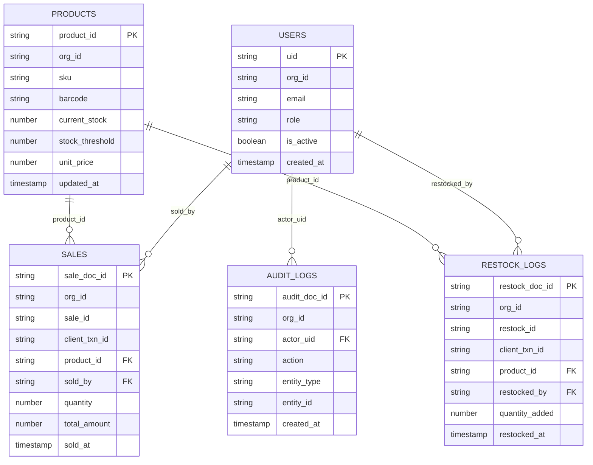

# Inventory Management System Technical Architecture

## 1. Scope and Objectives

This document specifies the architecture for a cross-platform Inventory Management System (IMS) targeting:

- Android (React Native via Expo)
- Web (React Native Web via Expo)

Primary goals:

- Real-time inventory visibility
- Reliable transactional tracking (sales and restocking)
- Offline-first behavior with deterministic synchronization
- Strong tenant isolation and role-based authorization
- Full auditability of security-sensitive actions

## 2. Technology Baseline

- Frontend: React Native + Expo Router
- Runtime targets: Android, Web
- Backend: Firebase
  - Authentication: Firebase Auth
  - Database: Cloud Firestore
  - Optional server logic: Cloud Functions for Firebase
- Local persistence (offline-first):
  - Preferred: SQLite (via Expo SQLite)
  - Alternative for high-write workloads: WatermelonDB (SQLite-backed)
  - Lightweight key/value metadata: AsyncStorage

## 3. High-Level Architecture

1. UI layer captures inventory events (scan/manual entry, sale submit, restock submit).
2. Events are written to local storage first (offline-safe outbox pattern).
3. Sync engine pushes queued events to Firestore when connectivity is available.
4. Firestore serves as the source of truth for shared, multi-device state.
5. Real-time listeners update local cache and UI projections.
6. Security Rules enforce organization and role boundaries.
7. Optional Cloud Functions enrich audit logs and emit low-stock notifications.

## 4. Frontend Architecture

### 4.1 Atomic Design Structure

The frontend should follow an Atomic Design architecture to keep the component system composable, testable, and platform-neutral.

Recommended layers:

- Atoms: low-level UI primitives such as text, button, input, badge, icon, loader.
- Molecules: composed field groups and small interactive units such as barcode input row, stock status chip, product card header.
- Organisms: feature-capable sections such as product list, sales form, restock form, low-stock panel.
- Templates: screen layouts defining structure without binding to concrete business data.
- Pages: route-level containers that connect templates to application state, navigation, and data hooks.

Recommended directory strategy:

```text
components/
  atoms/
  molecules/
  organisms/
  templates/
features/
  inventory/
  sales/
  restocking/
  users/
hooks/
services/
  firebase/
  sync/
  query/
```

Architectural rules:

- Atoms must not depend on business modules.
- Molecules may depend on atoms only.
- Organisms may depend on atoms and molecules.
- Pages may compose organisms, templates, hooks, and feature services.
- Firebase access, sync logic, and cache orchestration must remain outside presentation components.

This separation is required to avoid coupling platform-specific behavior, inventory rules, and Firestore concerns directly to reusable UI elements.

### 4.2 Feature and State Boundaries

- `features/inventory`: product catalog, stock projection, low-stock alerts.
- `features/sales`: sales transaction creation, validation, optimistic submission.
- `features/restocking`: inbound stock flows and supplier context.
- `features/users`: tenant membership, role-driven UI gating.
- `services/firebase`: Firestore repositories, auth adapters, rule-aligned writes.
- `services/sync`: local outbox processing and reconciliation.
- `services/query`: TanStack Query keys, hooks, and mutation helpers.

## 5. Cross-Platform Input and Hardware Strategy

### 5.1 Android (Camera Barcode Scanning)

- Module: `expo-barcode-scanner`
- Input mode: camera stream + barcode decoder
- UX expectations:
  - Permission request flow (`granted`, `denied`, `undetermined`)
  - Scan throttling/debounce to avoid duplicate reads
  - Fallback to manual SKU input when camera unavailable

### 5.2 Web (Manual/Keyboard Input)

- Input mode: text field for SKU/barcode + keyboard wedge scanner support
- Web limitations:
  - Browser camera APIs are inconsistent across devices and permissions
  - Keyboard wedge scanners typically behave as rapid keyboard input ending with Enter
- UX expectations:
  - Auto-focus input after each submission
  - Normalize barcode string (`trim`, uppercase where needed)
  - Enter-to-submit path for scanner and keyboard users

### 5.3 Platform Switch Logic

Use `Platform.OS` to select scanning implementation:

- Android: camera scanner component
- Web: text input component

See section 10 for an implementation outline.

## 6. Requests and Caching Layer

### 6.1 TanStack Query Requirement

The application should use TanStack Query as the standard requests and remote-state orchestration layer.

Rationale:

- Centralized query lifecycle management
- Deterministic loading, error, and refetch states
- Mutation orchestration with optimistic UI support
- Standardized cache invalidation semantics
- Improved separation between UI composition and data access logic

Recommended packages:

- `@tanstack/react-query`
- `@tanstack/react-query-persist-client`
- Optional persistence adapter appropriate to chosen storage backend

### 6.2 Query Layer Responsibilities

TanStack Query should be used for:

- Firestore-backed reads exposed through repository hooks
- Mutations for product updates, sales creation, and restock creation
- Cache hydration from local persistent storage
- Background refetch on reconnect or app foregrounding
- Coordinating optimistic updates before outbox acknowledgment

TanStack Query should not replace the durable offline outbox. It should sit above the repository layer and cooperate with SQLite/AsyncStorage persistence.

### 6.3 Query Key Strategy

All query keys should be tenant-aware.

Examples:

```ts
const queryKeys = {
  products: (orgId: string) => ["org", orgId, "products"],
  product: (orgId: string, productId: string) => ["org", orgId, "products", productId],
  sales: (orgId: string, filters?: Record<string, unknown>) => [
    "org",
    orgId,
    "sales",
    filters ?? {},
  ],
  restockLogs: (orgId: string, filters?: Record<string, unknown>) => [
    "org",
    orgId,
    "restock-logs",
    filters ?? {},
  ],
  users: (orgId: string) => ["org", orgId, "users"],
};
```

### 6.4 Mutation Pattern

Mutation flow:

1. Validate input in feature layer.
2. Write domain event into local outbox.
3. Apply optimistic cache update with `queryClient.setQueryData`.
4. Trigger sync worker.
5. Invalidate or reconcile related queries after remote acknowledgment.

Example targets for invalidation:

- product list after stock mutation
- single product after barcode-based lookup
- sales history after completed sale
- low-stock dashboard after stock threshold transition

### 6.5 Persistence and Rehydration

For web and mobile consistency, TanStack Query cache persistence should be limited to non-authoritative remote snapshots. Durable transactional intent must remain in SQLite outbox tables.

Recommended behavior:

- Persist query cache for faster cold start rendering.
- Rehydrate query cache on app launch.
- Treat Firestore listeners and sync reconciliation as final authority.
- Clear tenant-scoped caches on logout or organization switch.

## 7. Offline-First Data Strategy

### 7.1 Local Storage Model

Use SQLite tables for durable offline operation:

- `products_cache`
- `sales_outbox`
- `restock_outbox`
- `sync_queue`
- `sync_state`

Use AsyncStorage for small metadata:

- last sync cursor/timestamp
- selected organization
- transient UI preferences

### 7.2 Write Path (Local-First)

1. User action generates an immutable domain event:
   - `SALE_CREATED`
   - `RESTOCK_RECORDED`
   - `PRODUCT_UPDATED`
2. Event is committed to local outbox in a single local transaction.
3. UI is updated optimistically from local projection.
4. Sync worker uploads pending outbox items to Firestore.
5. On successful remote commit, local outbox item is marked `ACKED`.

### 7.3 Read Path

1. UI reads from local cache for low-latency rendering.
2. Firestore real-time listeners stream remote changes.
3. Listener updates local cache and resolves stale projections.

### 7.4 Conflict Resolution Policy

- Product metadata (name, price, threshold): last-write-wins using `updated_at`.
- Inventory quantity (`current_stock`): server-validated arithmetic updates only.
  - Do not allow arbitrary client-side overwrite of stock.
  - Apply stock deltas through sale/restock events.
- Transactional entities (`sales`, `restock_logs`, `audit_logs`): append-only, immutable records.

### 7.5 Idempotency and Retry

Each client-originated transaction must include:

- `client_txn_id` (UUID v4)
- `device_id`
- `created_at_client`

Sync retries must be safe:

- Duplicate submissions with same `client_txn_id` must be ignored/upserted server-side.

## 8. Firestore Data Model

Tenant model: single Firestore project with logical tenancy via `org_id` field.

### 8.1 `products` Collection

Purpose: product catalog and current stock projection.

| Field             | Type      | Required | Notes                                   |
| ----------------- | --------- | -------: | --------------------------------------- |
| `org_id`          | string    |      Yes | Tenant boundary key                     |
| `sku`             | string    |      Yes | Organization-unique SKU                 |
| `barcode`         | string    |       No | EAN/UPC/Code128 string                  |
| `name`            | string    |      Yes | Product display name                    |
| `description`     | string    |       No | Optional product details                |
| `category`        | string    |       No | Optional category                       |
| `current_stock`   | number    |      Yes | Integer >= 0                            |
| `stock_threshold` | number    |      Yes | Low-stock trigger threshold, default 10 |
| `unit_price`      | number    |      Yes | Decimal represented as number           |
| `is_active`       | boolean   |      Yes | Soft-active state                       |
| `created_by`      | string    |      Yes | Firebase `uid`                          |
| `updated_by`      | string    |      Yes | Firebase `uid`                          |
| `created_at`      | timestamp |      Yes | Server timestamp                        |
| `updated_at`      | timestamp |      Yes | Server timestamp                        |

Recommended constraints:

- Unique logical key: `(org_id, sku)`
- Optional unique logical key: `(org_id, barcode)` when barcode is present

### 8.2 `sales` Collection

Purpose: immutable sales transactions (stock-out movements).

| Field               | Type      | Required | Notes                        |
| ------------------- | --------- | -------: | ---------------------------- |
| `org_id`            | string    |      Yes | Tenant boundary key          |
| `sale_id`           | string    |      Yes | Business identifier          |
| `client_txn_id`     | string    |      Yes | Idempotency key              |
| `product_id`        | string    |      Yes | Reference to `products/{id}` |
| `sku`               | string    |      Yes | Denormalized for analytics   |
| `quantity`          | number    |      Yes | Integer > 0                  |
| `unit_price`        | number    |      Yes | Price at transaction time    |
| `total_amount`      | number    |      Yes | `quantity * unit_price`      |
| `sold_by`           | string    |      Yes | User `uid`                   |
| `sold_at`           | timestamp |      Yes | Server timestamp             |
| `created_at_client` | timestamp |       No | Client-generated timestamp   |
| `device_id`         | string    |       No | Originating device           |

Rules:

- Append-only: disallow update/delete from clients.

### 8.3 `restock_logs` Collection

Purpose: immutable incoming stock movements.

| Field               | Type      | Required | Notes                        |
| ------------------- | --------- | -------: | ---------------------------- |
| `org_id`            | string    |      Yes | Tenant boundary key          |
| `restock_id`        | string    |      Yes | Business identifier          |
| `client_txn_id`     | string    |      Yes | Idempotency key              |
| `product_id`        | string    |      Yes | Reference to `products/{id}` |
| `sku`               | string    |      Yes | Denormalized for search      |
| `quantity_added`    | number    |      Yes | Integer > 0                  |
| `cost_per_unit`     | number    |       No | Procurement cost             |
| `supplier`          | string    |       No | Supplier identifier/name     |
| `restocked_by`      | string    |      Yes | User `uid`                   |
| `restocked_at`      | timestamp |      Yes | Server timestamp             |
| `created_at_client` | timestamp |       No | Client-generated timestamp   |
| `device_id`         | string    |       No | Originating device           |

Rules:

- Append-only: disallow update/delete from clients.

### 8.4 `users` Collection

Purpose: identity profile, org membership, and role/permission model.

Document ID: Firebase `uid`.

| Field           | Type          | Required | Notes                                          |
| --------------- | ------------- | -------: | ---------------------------------------------- |
| `org_id`        | string        |      Yes | Primary organization                           |
| `email`         | string        |      Yes | Auth-aligned email                             |
| `display_name`  | string        |      Yes | User name                                      |
| `role`          | string        |      Yes | One of `viewer`, `cashier`, `manager`, `admin` |
| `permissions`   | array<string> |       No | Optional fine-grained flags                    |
| `is_active`     | boolean       |      Yes | Access toggle                                  |
| `last_login_at` | timestamp     |       No | Last successful sign-in                        |
| `created_at`    | timestamp     |      Yes | Server timestamp                               |
| `updated_at`    | timestamp     |      Yes | Server timestamp                               |

### 8.5 `audit_logs` Collection

Purpose: immutable audit trail for sensitive or security-relevant actions.

| Field         | Type      | Required | Notes                                     |
| ------------- | --------- | -------: | ----------------------------------------- |
| `org_id`      | string    |      Yes | Tenant boundary key                       |
| `actor_uid`   | string    |      Yes | Acting user                               |
| `actor_role`  | string    |      Yes | Role snapshot                             |
| `action`      | string    |      Yes | e.g. `PRODUCT_UPDATE`, `USER_ROLE_CHANGE` |
| `entity_type` | string    |      Yes | e.g. `product`, `sale`, `user`            |
| `entity_id`   | string    |      Yes | Target document ID                        |
| `before`      | map       |       No | Redacted pre-state                        |
| `after`       | map       |       No | Redacted post-state                       |
| `metadata`    | map       |       No | Extra context (IP hash/device)            |
| `created_at`  | timestamp |      Yes | Server timestamp                          |

Rules:

- Append-only: no client update/delete.

## 9. Firestore Indexing Plan

Create composite indexes for common filtered/sorted queries:

```json
[
  {
    "collectionGroup": "products",
    "queryScope": "COLLECTION",
    "fields": [
      { "fieldPath": "org_id", "order": "ASCENDING" },
      { "fieldPath": "is_active", "order": "ASCENDING" },
      { "fieldPath": "updated_at", "order": "DESCENDING" }
    ]
  },
  {
    "collectionGroup": "sales",
    "queryScope": "COLLECTION",
    "fields": [
      { "fieldPath": "org_id", "order": "ASCENDING" },
      { "fieldPath": "sold_at", "order": "DESCENDING" }
    ]
  },
  {
    "collectionGroup": "restock_logs",
    "queryScope": "COLLECTION",
    "fields": [
      { "fieldPath": "org_id", "order": "ASCENDING" },
      { "fieldPath": "restocked_at", "order": "DESCENDING" }
    ]
  },
  {
    "collectionGroup": "audit_logs",
    "queryScope": "COLLECTION",
    "fields": [
      { "fieldPath": "org_id", "order": "ASCENDING" },
      { "fieldPath": "created_at", "order": "DESCENDING" }
    ]
  }
]
```

## 10. Inventory Alert Logic (Real-Time Low Stock)

Low-stock condition:

`is_low_stock = current_stock < stock_threshold`

Example threshold behavior:

- Default `stock_threshold = 10`
- Trigger condition: `current_stock < 10`

Recommended execution model:

1. Stock changes occur from sale/restock events.
2. A transaction (client or Cloud Function) computes new `current_stock`.
3. If low-stock condition changes from false to true:
   - set `low_stock_flag = true` in product projection, and
   - create an `audit_logs` entry (`action = LOW_STOCK_TRIGGERED`), and
   - optionally push user notification (FCM/email/webhook).
4. If stock recovers (`current_stock >= stock_threshold`), clear `low_stock_flag`.

Pseudo-logic:

```ts
const wasLow = previous.current_stock < previous.stock_threshold;
const isLow = next.current_stock < next.stock_threshold;

if (!wasLow && isLow) {
  next.low_stock_flag = true;
  emitAlert("LOW_STOCK_TRIGGERED", next.product_id);
}
if (wasLow && !isLow) {
  next.low_stock_flag = false;
  emitAlert("LOW_STOCK_RESOLVED", next.product_id);
}
```

## 11. Mermaid ERD (Firestore Collections)



## 12. Barcode Entry Integration Design

### 12.1 Component Responsibility Split

- `BarcodeEntryGate`
  - Detect platform
  - Render Android scanner or Web/manual input
- `AndroidBarcodeScanner`
  - Camera permission handling
  - Decode callback with duplicate suppression
- `WebBarcodeInput`
  - Text input with Enter submit
  - Keyboard wedge scanner compatibility

Atomic Design placement:

- `BarcodeEntryGate`: organism
- `AndroidBarcodeScanner`: molecule or organism depending on permission and error UI complexity
- `WebBarcodeInput`: molecule
- shared text field, button, badge, and helper text: atoms

### 12.2 Reference Logic (React Native)

```tsx
import { Platform, TextInput, View } from "react-native";
import { BarCodeScanner } from "expo-barcode-scanner";
import { useCallback, useRef, useState } from "react";

type Props = {
  onDetected: (value: string) => void;
};

export function BarcodeEntryGate({ onDetected }: Props) {
  if (Platform.OS === "web") {
    return <WebBarcodeInput onDetected={onDetected} />;
  }
  return <AndroidBarcodeScanner onDetected={onDetected} />;
}

function AndroidBarcodeScanner({ onDetected }: Props) {
  const [locked, setLocked] = useState(false);

  const onScan = useCallback(
    ({ data }: { data: string }) => {
      if (locked) return;
      setLocked(true);
      onDetected(data.trim());
      setTimeout(() => setLocked(false), 700);
    },
    [locked, onDetected],
  );

  return <BarCodeScanner onBarCodeScanned={onScan} style={{ width: "100%", height: 280 }} />;
}

function WebBarcodeInput({ onDetected }: Props) {
  const [value, setValue] = useState("");
  const inputRef = useRef<TextInput>(null);

  const submit = useCallback(() => {
    const normalized = value.trim();
    if (!normalized) return;
    onDetected(normalized);
    setValue("");
    inputRef.current?.focus();
  }, [value, onDetected]);

  return (
    <View>
      <TextInput
        ref={inputRef}
        value={value}
        autoFocus
        placeholder="Enter SKU or barcode"
        onChangeText={setValue}
        onSubmitEditing={submit}
        returnKeyType="done"
      />
    </View>
  );
}
```

Operational notes:

- Android permission must be requested before scanner rendering.
- For unsupported hardware/browser contexts, always expose manual entry fallback.

## 13. Firestore Security Rules (Organization + Role Isolation)

Assumptions:

- User has custom claims: `orgId` and `role`.
- Roles: `viewer < cashier < manager < admin`.
- All tenant-scoped documents include `org_id`.

```js
rules_version = '2';
service cloud.firestore {
  match /databases/{database}/documents {

    function signedIn() {
      return request.auth != null;
    }

    function orgId() {
      return request.auth.token.orgId;
    }

    function role() {
      return request.auth.token.role;
    }

    function sameOrgFromResource() {
      return signedIn() && resource.data.org_id == orgId();
    }

    function sameOrgFromRequest() {
      return signedIn() && request.resource.data.org_id == orgId();
    }

    function isViewer() {
      return role() in ['viewer', 'cashier', 'manager', 'admin'];
    }

    function isCashier() {
      return role() in ['cashier', 'manager', 'admin'];
    }

    function isManager() {
      return role() in ['manager', 'admin'];
    }

    function isAdmin() {
      return role() == 'admin';
    }

    function immutableOnUpdate(field) {
      return request.resource.data[field] == resource.data[field];
    }

    // PRODUCTS
    match /products/{productId} {
      allow read: if sameOrgFromResource() && isViewer();
      allow create: if sameOrgFromRequest() && isManager();
      allow update: if sameOrgFromResource()
                    && sameOrgFromRequest()
                    && isManager()
                    && immutableOnUpdate('created_at')
                    && immutableOnUpdate('created_by');
      allow delete: if sameOrgFromResource() && isAdmin();
    }

    // SALES (append-only)
    match /sales/{saleId} {
      allow read: if sameOrgFromResource() && isCashier();
      allow create: if sameOrgFromRequest()
                    && isCashier()
                    && request.resource.data.sold_by == request.auth.uid;
      allow update, delete: if false;
    }

    // RESTOCK_LOGS (append-only)
    match /restock_logs/{restockId} {
      allow read: if sameOrgFromResource() && isCashier();
      allow create: if sameOrgFromRequest()
                    && isManager()
                    && request.resource.data.restocked_by == request.auth.uid;
      allow update, delete: if false;
    }

    // USERS
    match /users/{uid} {
      allow read: if signedIn()
                  && (
                    uid == request.auth.uid ||
                    (sameOrgFromResource() && isManager())
                  );

      allow create: if sameOrgFromRequest() && isAdmin();

      allow update: if signedIn() && (
                    // Self profile update, role immutable
                    (uid == request.auth.uid
                      && immutableOnUpdate('role')
                      && immutableOnUpdate('org_id'))
                    ||
                    // Admin management inside tenant
                    (sameOrgFromResource() && sameOrgFromRequest() && isAdmin())
                  );

      allow delete: if sameOrgFromResource() && isAdmin();
    }

    // AUDIT_LOGS (append-only)
    match /audit_logs/{auditId} {
      allow read: if sameOrgFromResource() && isManager();
      allow create: if sameOrgFromRequest()
                    && isCashier()
                    && request.resource.data.actor_uid == request.auth.uid;
      allow update, delete: if false;
    }
  }
}
```

## 14. Synchronization Workflow (Detailed)

### 14.1 Outbound Sync (Client -> Firestore)

1. Read `sync_queue` where `status = PENDING` ordered by `created_at`.
2. For each item:
   - open Firestore write batch/transaction
   - write immutable transaction document (`sales` or `restock_logs`)
   - update related `products.current_stock`
   - set `updated_at` / `updated_by`
3. On success: mark queue item `ACKED`.
4. On transient failure: exponential backoff and retain `PENDING`.
5. On permanent failure (authorization/schema): mark `FAILED`, require user/operator intervention.

### 14.2 Inbound Sync (Firestore -> Client Cache)

1. Attach listeners scoped by `org_id` and updated cursor.
2. Upsert remote docs into local SQLite cache.
3. Recompute UI projections (`low_stock`, daily sales aggregates, etc.).
4. Persist new sync cursor in AsyncStorage.

### 14.3 Connectivity Transitions

- Online -> Offline:
  - Continue local writes only.
  - Show pending-sync indicator.
- Offline -> Online:
  - Trigger immediate outbound sync pass.
  - Reconcile cache with remote listeners.

### 14.4 TanStack Query Integration with Sync

Synchronization and query orchestration must cooperate as follows:

1. Query hooks read normalized repository outputs.
2. Mutations enqueue local writes first.
3. Query cache is updated optimistically for immediate UI continuity.
4. Sync completion invalidates or patches affected tenant query keys.
5. Firestore listener deltas are merged back into local cache and query cache.

This avoids direct coupling between Firestore listeners and page-level components while preserving deterministic cache refresh behavior.

## 15. Operational and Security Considerations

- Never trust client-computed totals for financial accounting without server validation.
- Use Cloud Functions for privileged stock mutation if strict tamper resistance is required.
- Store only non-sensitive audit metadata; hash/redact IP or device identifiers.
- Enforce app version minimums for schema migrations.
- Monitor failed writes and rule-denied events in Firebase logs.
- Do not execute Firestore calls directly from atoms, molecules, or organisms.
- Scope TanStack Query caches by tenant to avoid organization data leakage in shared sessions.

## 16. Suggested Role Matrix

| Capability             | viewer | cashier | manager | admin |
| ---------------------- | -----: | ------: | ------: | ----: |
| View products          |    Yes |     Yes |     Yes |   Yes |
| Create/update products |     No |      No |     Yes |   Yes |
| Delete products        |     No |      No |      No |   Yes |
| Create sales           |     No |     Yes |     Yes |   Yes |
| Create restock logs    |     No |      No |     Yes |   Yes |
| View audit logs        |     No |      No |     Yes |   Yes |
| Manage users/roles     |     No |      No |      No |   Yes |

## 17. Implementation Checklist

- Add local persistence package (`expo-sqlite` or WatermelonDB).
- Add TanStack Query packages (`@tanstack/react-query`, optional persist client adapter).
- Create `QueryClient` provider at app root and define tenant-aware query keys.
- Introduce Atomic Design folder boundaries for reusable UI composition.
- Move Firebase reads/writes into repository and service modules, not UI components.
- Implement outbox + sync worker with idempotent transaction IDs.
- Add scanner/manual barcode gate component using platform switch.
- Add low-stock projection and alert generation path.
- Deploy Firestore security rules and test with role-based test matrix.
- Define and deploy required composite indexes.
- Instrument audit log writes for all privileged operations.
